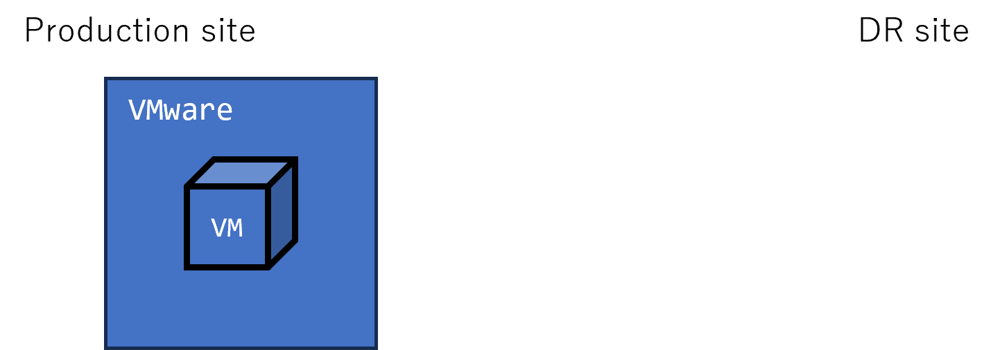
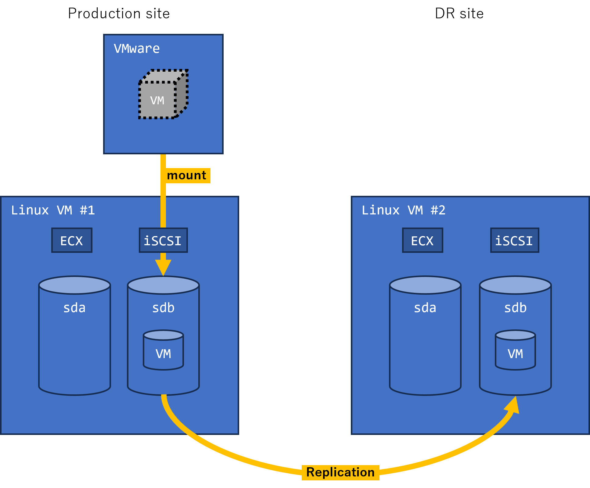
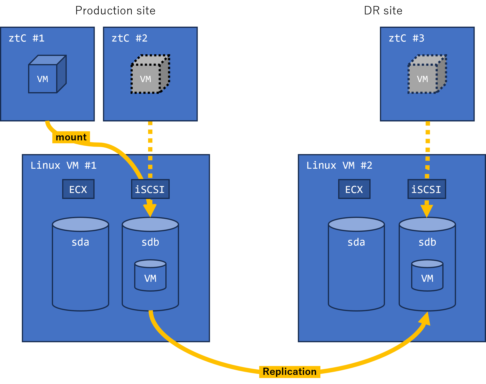

# Migration from VMware

1. Existing VMware runs VMs in it.

   

2. Build SDS (Software Defined Storage) which is ECX iSCSI Target Cluster.
   Export VMs from VMware to SDS by V2V utility, that's V2V from VMware to KVM.
   VMs images are replicated to DR site by ECX.

   

3. ztC#1 mounts SDS and runs VMs on it.
   When a WRITE operation is issued on a VM, it is reflected to the VM image in SDS, and the change is replicated to DR site.
   VMs on ztC#1 failover to #2 for HA and to #3 for DR.

   
